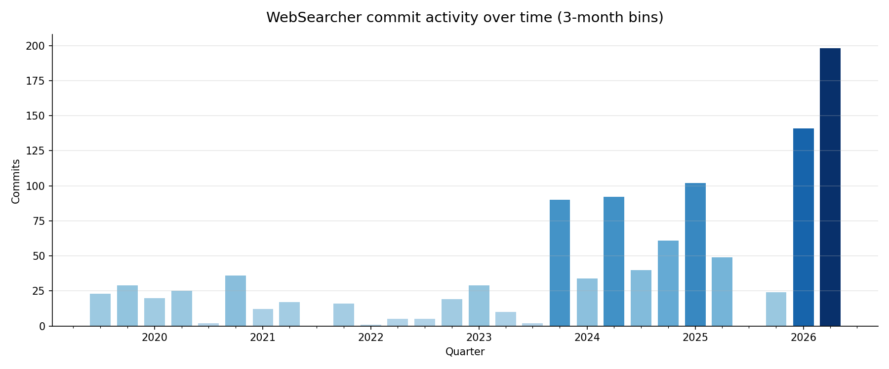

# WebSearcher: A Story Told in Commits

*A reading of 1,082 commits, from `Initial commit` to the present.*



WebSearcher is a tool for scraping and parsing Google search results. That one
sentence explains almost everything that follows — because the story of this
repo is really the story of one person trying to keep up with a webpage that
will not stop changing.

## Act I — Late nights and packaging fiddliness (2019)

The first commit lands at **01:39 in the morning** on August 14, 2019.
Eighteen minutes later: `Improve readme`. The tone for the next several years
is set immediately — this is a side-of-the-desk research tool, built in the
margins of the day. That first README already states the mission it still
serves: "tools for conducting algorithm audits of web search." (It also tells
you to `git clone https://github.com/github/gitronald/...` — a doubled
`github/` that nobody would notice for a while.)

The early commits are the universal first-weeks-of-a-Python-package experience:
`Long description`, then `Longer description`, then `Using newlines`, all in
service of getting the PyPI page to render. The README heading literally read
`# WebSearcher 0.1.2` — the version was baked into the prose, which is exactly
why so many early commits are version wrangling. Somewhere in the dance the
author bumps `0.1.2 → 0.1.2` (to the *same* version), ships `0.1.8 → 0.1.9`
**twice**, and files `Fix bumpversion` — the first skirmish in a release-tooling
campaign that would outlast almost everything else in the repo. Nobody's
watching yet, and it shows. One near-midnight window says it all:

```text
2019-09-23 23:22  Long description
2019-09-23 23:23  Bump version: 0.1.4 → 0.1.5
2019-09-23 23:37  Longer description
2019-09-23 23:50  Using newlines
2019-09-23 23:50  Bump version: 0.1.5 → 0.1.6
```

By December 2019 the real work announces itself: `Overhaul of component
classifier, add scholarly articles component`. The thing that WebSearcher will
spend its entire life doing — looking at a chunk of Google HTML and deciding
*what kind of result is this* — is already the beating heart of the project.

## Act II — The pandas wars and the arrival of collaborators (2020–2022)

2020 is the busiest early year (83 commits), and one morning in November
contains the single funniest sequence in the history:

```text
2020-11-30 11:44  adinagit   Pandas remove (#7)
2020-11-30 11:48  R.E.R.     Revert "Pandas remove (#7)" (#9)
2020-11-30 11:49  gitronald  remove: testing artifact
2020-11-30 11:57  gitronald  remove: testing artifact
2020-11-30 13:23  gitronald  update: uncomment result scraper, remove pandas
2020-11-30 13:53  gitronald  remove: testing artifact
2020-11-30 14:21  gitronald  update: remove pandas requirements
```

A contributor's PR to remove pandas is reverted **four minutes** after it
merges — and then, ninety minutes later, the author quietly removes pandas
*himself*. (Note `remove: testing artifact` surfacing three separate times in
one afternoon, like a stain that keeps coming back.) The first attempt to drop
pandas was actually back in September 2019: `Remove pandas dependency`. It did
not take either. Pandas would not be fully exorcised from the core until
**February 2026** — roughly six and a half years, and a migration to polars,
later. Some dependencies do not go quietly.

This era also produced the project's unofficial thesis statement, buried in the
changelog for `0.2.5` (July 2020):

> Google Search, like most online platforms, undergoes changes over time...
> This makes parsing a goal with a moving target. Sometime around February
> 2020, Google changed a few elements of their HTML structure which broke this
> parser... there's no guarantee on future compatibility. In fact, there is
> almost certainly the opposite: more changes will inevitably occur.

Every act that follows is a footnote to that paragraph.

It was also in these years that WebSearcher stopped being a solo project. A
small cast of collaborators filed in, each leaving a very human trace:

- **emmalurie** — one commit, maximally humble: `changed if if else to if elif else`.
- **Stefan McCabe** — `Accept path-like inputs in utils.py`.
- **dzheng2019** — a genuine maintainer stint across 2020–2021: `added a checks
  to prevent key error`, `removed emoji dependency`, parser updates.
- **adinagit** — author of the doomed pandas removal.
- **Jeffrey Gleason** (a.k.a. **jlgleason**) — the most substantial outside
  contributor, threading through 2021–2024: `New Types (e.g. shopping_ads)`,
  knowledge subtypes for `flights, hotels, events`, and the wonderfully
  weary `small fixes for 2023/24 data`.

2021 and 2022 are the quiet years — 45 and 30 commits. The longest silence in
the whole history is a **155-day gap** in 2021. WebSearcher breathes on the
academic calendar: it goes dormant between the projects that need it, then
roars back when a new paper or a new Google layout demands it.

## Act III — The versioning identity crisis (late 2022 – mid 2023)

For about half a year, the project abandons semantic versioning for calendar
versioning. It does not go well. Watch the **commit date** in the left column
against the **version** on the right:

```text
2022-12-19  Bump to 2020.0.0          ← a "2020" version, tagged in 2022
2022-12-21  Bump to 2022.12.18
2023-01-04  Bump to 2023.01.04
2023-01-09  Bump to 2023.01.06
2023-03-25  Bump to 2023.01.27-a      ← "Jan 27" — shipped in late March
2023-03-27  Bump to 2023.01.27-b
2023-04-10  Bump to 2023.01.27-c
2023-04-10  Bump to 2023.01.27-d
2023-05-16  Update to version 2023.01.27-d (#34)   ← merged in May
```

The whole point of date versioning is that the version *is* the date — and here
the version `2020.0.0` is tagged in December 2022, while `2023.01.27` is bumped
through four patch letters across March and April and finally merged in May. The
date stopped meaning the date almost immediately. The author's own changelog
files the verdict with admirable honesty:

> attempt at date versioning that seemed like a good idea at the time ¯\\\_(ツ)\_/¯

Running alongside the scheme crisis is a quieter **tooling** crisis: the release
machinery is swapped out almost as often as the numbers. `bumpversion` (2019)
gives way to `tbump` (`add: switching to tbump`, December 2022), which gives way
to throwing up one's hands entirely (`update: manual versioning`, March 2023),
which eventually gives way to today's `stanza`. By mid-2023 the version numbers
quietly return to semver at `0.3.x`, and the date experiment is never spoken of
again.

## Act IV — The renaissance (2023–2024)

Something changes in 2023: commits triple to 131, then nearly double again to
**227 in 2024**. This is the great rewrite. The parser stops being a pile of
functions and becomes an architecture:

- `update: rewrite extractors as class that tracks and passes along Component classes`
- `update: restructure parser to use component classes`
- `update: refactor notices parser as class`

And running underneath it all, the **eternal struggle of a SERP scraper**:
Google keeps redesigning the page.

- `add: initial extract from left-bar layout`
- `small fixes for 2023/24 data`
- `restore knowledge_panel cmpt-attr check to jscontroller qTdDb`

That last one is the whole job in a single line. WebSearcher's correctness
depends on Google's obfuscated class names like `qTdDb` — strings with no
meaning that can vanish in any silent A/B test, taking a parser with them.

## Act V — The AI Overview era (2025–2026)

2025 brings a tooling reckoning. The packaging stack, having already crawled
from **poetry v1 → poetry v2** (`0.5.0`), now jumps again to **uv** (`0.6.8`),
and type hints are modernized to 3.10+ syntax. The bigger shift is in *how data
gets collected at all*: for years the scraper used plain `requests`, until
Google quietly closed that door. The `0.6.0` changelog records the surrender in
nine words — "requests no longer works without a redirect" — and an outside
contributor, **EvanUp**, lands the pivot: `switching from requests to selenium`.
The two backends have been in a tug-of-war ever since (a `requests_searcher`
returns in 2026), but the direction of pressure is always Google's.

Then 2026 explodes: **339 commits and counting**, already the most active year
in the project's life, with the single busiest quarter ever. The reason is in
nearly every message: **AI Overviews**. Google bolted a generative answer box
onto the top of the page, and WebSearcher has been reverse-engineering it ever
since:

- `add legacy sge markup support to ai_overview parser`
- `enrich ai overview with payload-sourced citations and richer sources`
- `record unavailable ai_overview state for declined overviews`

This is also the era of **plan-driven development** (plans 021 through 025) and
of **dependabot**, which had grown from an occasional visitor into a swarm —
seven dependency-bump PRs merged in a single seventeen-minute stretch one
morning:

```text
09:20  Merge pull request #122 ... dependabot/uv/urllib3-2.7.0
09:25  Merge pull request #121 ... dependabot/uv/idna-3.15
09:26  Merge pull request #120 ... dependabot/uv/protobuf-7.34.1
09:29  Merge pull request #119 ... dependabot/uv/pydantic-2.13.4
09:34  Merge pull request #118 ... dependabot/uv/requests-2.34.2
09:35  Merge pull request #117 ... dependabot/uv/pytest-cov-7.1.0
09:37  Merge pull request #116 ... dependabot/uv/polars-1.40.1
```

And — fittingly, given how this very document was assembled — the project logs
its first commit authored by an AI:

> `2026-05-10` — **Claude**: `docs(plans): add 017 parse pipeline optimization plan`

## The toil and the anguish

Every long-lived codebase has its scar tissue. WebSearcher's reads like a diary
of small defeats:

- `fix return in finally in requests_searcher`, followed later by
  `move return out of finally block to fix syntax warning` — the same `finally`
  block, wrestled twice.
- `fix: drop debug print and fix print var` — the debug `print` that escaped
  into a commit, as it always does.
- The same fix, committed twice, three minutes apart, because the first one
  evidently didn't:

  ```text
  2023-01-04 11:25  fix: ad url parsing
  2023-01-04 11:28  fix: ad url parsing
  ```
- `fix: 'None' passed as location again` — note the **`again`**. The bug came
  back.
- `update: ignore annoying dropbox file` — the adjective says everything.
- `Update header_text en español v2.py` — a source file committed with a space
  *and* a `v2` *and* the word "español" in its name. Somewhere, a linter wept.

## The cast

| Author | Commits | Note |
|---|---|---|
| gitronald / Ronald E. Robertson | 932 + 85 | The author; one identity, two git names (the second from GitHub merge buttons) |
| dependabot[bot] | 38 | Tireless, never sleeps, occasionally swarms |
| jlgleason / Jeffrey Gleason | 7 + 3 | The most substantial human collaborator |
| dzheng2019 | 7 | The 2020–2021 maintainer stint |
| wanLo | 2 | External HTML loading, `bs4` package-name fix |
| EvanUp | 2 | requests → selenium, AI overview expansion |
| Andrew Schwartz | 1 | Post-review pass |
| emmalurie | 1 | `if if else` → `if elif else` |
| Stefan McCabe | 1 | Path-like inputs |
| mariaelissat | 1 | The Spanish header strings |
| Claude | 1 | The first robot contributor |

## The moral

A SERP parser is a structure built on sand: the ground (Google's HTML) shifts
without warning, and the only response is another commit. WebSearcher's history
isn't a smooth climb — it's long quiet stretches punctuated by frantic bursts,
each burst triggered by Google shipping a new layout, a new card type, or a
whole new AI answer box. Seven years in, the activity chart is pointing
straight up, which means the work is nowhere near done. It never will be.

---

*Artifacts in this directory:*
- `get_commits.py` — dumps every commit to `commits.csv` (hash, timestamp, message)
- `plot_activity.py` — renders `commit_activity.png` (commits per quarter)
- `commits.csv` — the raw data this story was read from
- `commit_activity.png` — the activity chart above
